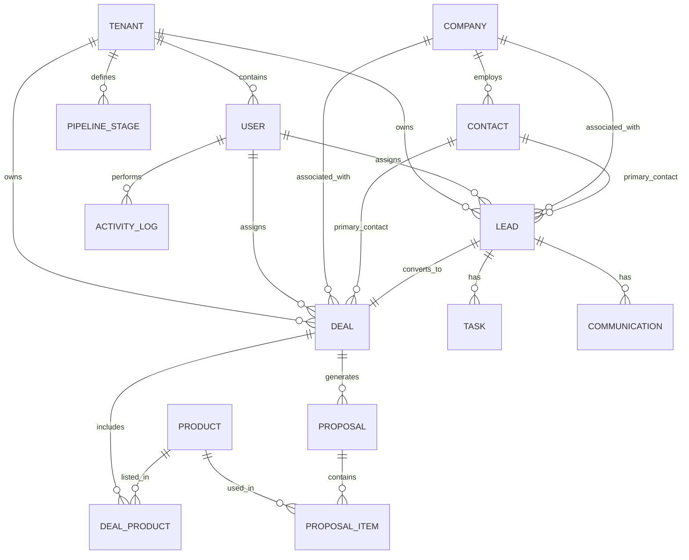

# IA Portal — Sales CRM Database Schema Documentation

## Overview
This document describes the database schema for the Sales CRM, built with **Prisma** and **PostgreSQL**. The system is designed as a multi-tenant SaaS application with a focus on sales pipeline management, customer relations, and future-ready AI integrations via the OpenClaw platform.

### Core Design Principles
1. **Multi-tenancy**: Every business table includes a `tenantId` to ensure data isolation.
2. **AI-Ready**: `ai_*` fields are present in major entities (Leads, Deals, Communications) to support Phase 2 AI automation.
3. **Audit Trails**: Immutable `ActivityLog` records every significant state change.
4. **Dynamic Pipelines**: Flexible `PipelineStage` management allowing per-tenant customization.

---

## 1. Architectural Modules

### 1.1 Tenant & Auth
Manages the organizational structure and access control.
- **Tenant**: The top-level organization unit. Supports custom slugs/domains and billing plans.
- **User**: Individuals belonging to a tenant. Supports authentication and profile management.
- **RBAC (Role-Based Access Control)**:
  - `Role`: Custom or system-defined roles per tenant.
  - `Permission`: Resource-action pairs (e.g., `leads:create`).
  - `UserTenantRole`: Links users to specific roles within a tenant.

### 1.2 CRM Core (Relationships)
The foundation of customer data.
- **Company**: B2B organizational records.
- **Contact**: Individual person records. Contacts can belong to companies.

### 1.3 Sales Pipeline
Tracking the progression from inquiry to closure.
- **PipelineStage**: Configurable stages for both Leads and Deals. Supports order (`position`) and UI colors.
- **Lead**: Early-stage sales inquiries. Can be converted into Deals.
- **Deal**: Qualified opportunities with monetary value and win probability.
- **StageMigration**: History of stage movements, especially useful for bulk migrations or auditing.

### 1.4 Sales Operations
Daily activities and communications.
- **Task**: To-do items assigned to users, linked to Leads, Deals, or Contacts.
- **Communication**: A unified log for transparency across all channels (Email, Call, SMS, WhatsApp, Meeting, AI interactions).

### 1.5 Catalog & Sales Documents
Managing products and formal offers.
- **Product**: Service/product catalog with support for various billing types (one-time, recurring).
- **DealProduct**: Links products to specific deals with quantities and discounts.
- **Proposal**: Document-based offers (Quotes) sent to customers. Supports versioning (`revisions`).
- **ProposalItem**: Specific line items within a proposal.

### 1.6 Audit & AI
- **ActivityLog**: Immutable trail of events performed by humans or AI agents.
- **OpenClaw (Phase 2)**: Entities include fields like `aiSentimentScore`, `aiGatheredNeeds`, `aiNextBestAction`, and `aiAgentId`.

---

## 2. Entity Relationship Diagram (Conceptual)

---

## 3. Data Dictionary (Key Models)

### Model: `Tenant`
| Field | Type | Description |
| :--- | :--- | :--- |
| `name` | String | Organization name. |
| `slug` | String | Unique identifier for subdomains. |
| `plan` | Enum | Subscription tier (Free, Starter, Growth, Enterprise). |
| `settings` | Json | Tenant-specific config flags. |

### Model: `User`
| Field | Type | Description |
| :--- | :--- | :--- |
| `email` | String | Unique within a tenant. |
| `role` | Enum | High-level role shortcut (SuperAdmin, Admin, SalesRep, etc.). |
| `status` | Enum | Account status (Active, Invited, Suspended). |

### Model: `Lead`
| Field | Type | Description |
| :--- | :--- | :--- |
| `title` | String | Subject of the lead. |
| `stageId` | String | Current pipeline stage. |
| `source` | Enum | Channel (Manual, WebForm, Csv, AI Agent). |
| `priority` | Enum | Business importance (Low to Urgent). |
| `isConverted` | Boolean | True if the lead has become a Deal. |

### Model: `Deal`
| Field | Type | Description |
| :--- | :--- | :--- |
| `status` | Enum | Open, Won, Lost, OnHold. |
| `value` | Decimal | Monetary value of the opportunity. |
| `probability`| Int | 0-100% win forecast. |

---

## 4. Enums Reference

| Enum | Key Values |
| :--- | :--- |
| **UserRole** | `superAdmin`, `admin`, `salesManager`, `salesRep`, `viewer` |
| **LeadSource** | `manual`, `webForm`, `importCsv`, `aiAgent`, `referral`, `socialMedia` |
| **DealStatus** | `open`, `won`, `lost`, `onHold` |
| **TaskType** | `call`, `email`, `meeting`, `demo`, `proposal` |
| **CommunicationType** | `email`, `call`, `meeting`, `note`, `sms`, `whatsapp` |
| **ProposalStatus** | `draft`, `sent`, `viewed`, `accepted`, `rejected`, `revised` |

---

## 5. Notes for Developers
- **Soft Deletes**: Use the `deletedAt` field for logical erasure.
- **Timestamps**: All tables include `createdAt` and `updatedAt`.
- **Primary Keys**: CUIDs are used for all IDs to ensure distributed uniqueness.
- **Decimals**: All currency fields (Price, Value, Tax) use `Decimal(15, 2)` for precision.
